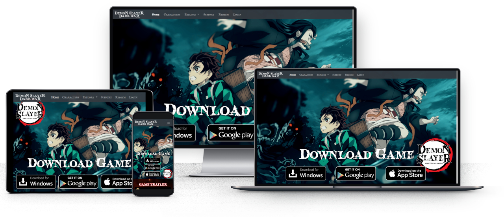
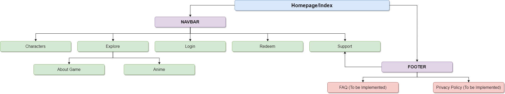

# Demon Slayer - Dark War

Welcome to Demon Slayer - Dark War, a game where you will play as Tanjiro to gather and form your team of Demon Slayers! This website will be used to promote the game and give our potential players a glimpse of how the game looks like.

# Demo
Demo of the site can be found [here](https://yuhengen.github.io/TGC9-Interactive-Frontend-DemonSlayer/)

---



---

# UI/UX
# Identifying the Users (Strategy)
The primary purpose of this website is to let players download the game, as well as to give the game and the Demon Slayer series more exposure. The contents of the website will therefore contain the download links and more information about the Demon Slayer - Dark War game, targeted at potential players.

## Owner Stories
```
- As the owner of the website, I want to create a user-friendly and attractive website so that my visitors can easily download the game on different platforms, as well as enjoy their time on the site.

- As the game developer, I want a Support page so that our players can provide feedback to us regarding game issues or improvements.

- As the game developer and publisher, I want to keep the players updated on the newest developments of the game.

- As the game developer, I want the existing and potential players to visit the website so that we can showcase to them the gameplay videos and its contents, as well as engaging in special events and contests.

- As the owner of the Kimetsu no Yaiba (Demon Slayer) series, I want the fans of the series to visit the website so that I can let them experience Demon Slayer in other forms other than the anime, such as the game.
```
## User Stories (Players and Potential players)
```
- As a user, I want to find a website to download the game so that I can play it on different platforms.

- As a player, I want a platform where I can reach the support team so that I can provide valuable feedback and improvements to the development team of the game.

- As a user, I want a website where I can preview the game and its contents so that I will know whether I want to try the game out.
```

# The Requirements (Scope)
## Current Features
```
- Download the game on PC, Android/Apple phones via provided links
- View playable characters by using Axios to read JSON files
- Preview gameplay videos from YouTube and in-game screenshots & GIFs
- Provide relevant feedback to support team with form validation
- View relevant content such as the anime series, displayed using API
- Mobile responsiveness
- Ease of navigation with the Bootstrap Navbar
- Credits and more navigation on Footer
```
## Features to Implement in Future
```
- Sign Up/Login with Email or Social Media sites
- Claiming of Code (For in-game rewards)
- FAQ page with search function
- Privacy Policy page (When necessary)
- Database/Local storage for login and prevention of the re-loading screen
```

# Developing the Site Structure (Structure)
The Demon Slayer - Dark War website has a navigation bar and footer on every page, so that users can access every page with ease. As there are a lot of local images in the pages, a loading overlay has been added to every page so as to pre-load the assets before visitors can see them.

## Sitemap
The sitemap is as shown in the diagram below:

---



---


# Developing Page Structure and Organize Interactions (Skeleton)
Most important features and information are displayed first. Our priority is to have players DOWNLOAD the game, so it is the first thing we see upon entering the website. The font size is also generally the largest so as to catch attention.

The Demon Slayer - Dark War wireframes will be added soon.

### Home
- Starts with a home page, displaying a banner of the Demon Slayer series and the download buttons
- This page's main focus is to get the visitors to download the game, which is the first thing they see upon entering the site
- Includes the game trailer and news about the game as visitors scroll down the page
### Characters
- Upon entering the Characters page, there will be a character viewer where players can expect to see the playable characters in game
- More information and introduction regarding the factions and other characters are also shown as you scroll down the page
### Explore: About
- Visitors can view the game features and trailer on this page
### Explore: Anime
- Visitors can view information regarding the anime here
- Page will also redirect them to official sources to watch the anime
### Support
- A page mainly used for contact purposes
- Users can contact the team for various types of issues here, simply by filling up the form with their relevant information
### Redeem (TBC)
- A page for users to redeem game codes, for in-game rewards (Function to be implemented in the future)
### Login (TBC)
- A page for users to login to their accounts (Function to be implemented in the future)
- Used for account management, redeeming codes and participating in web events
### FAQ (TBC)
- A page for FAQs for general enquiries
### Privacy Policy (TBC)
- A page for the privacy policy for the game and website

# Designing the Graphics User Interface (Surface) 
## Colors
After some research and considerations, the main colors I decided to use are those closely related to the Demon Slayer logo and theme.
```
- Black/Grey to symbolize darkness and calamity.
- White to contrast the Black, the light in the darkness, as well as a symbol of faith.
- Red to symbolize chaos and blood.
```

## Fonts
The fonts which are mainly used on the website is Sans Serif, the default font family. I also used the Demon Slayer title font [Blood Crow](https://fontmeme.com/fonts/blood-crow-font/) for decorative purposes.

# Technologies
I used HTML5 to structure the webpages and CSS3 to style the them, and also utilized Bootstrap 4 for layout, such as the NavBar and Accordion for the display of the Anime episodes' title and description.
- HTML5 to structure the webpages
- CSS to style the webpages
- Javascript to implement interactivity with the website
- [Bootstrap 4](https://getbootstrap.com/docs/4.5/getting-started/introduction/) for navbar, carousel, cards, accordion and forms
- [GitHub](https://github.com/) for version control and repositories
- [GitPod](https://gitpod.io/) and [Visual Studio Code](https://code.visualstudio.com/) as my coding platform
- [Axios](https://github.com/axios/axios) to read from JSON files
- [IMDB API](https://imdb-api.com/api) to display Anime information
- [GIMP](https://www.gimp.org/) for image editing
- [Responsive Web Design Checker](https://responsivedesignchecker.com/) to check how it looks like on other devices

# Deployment
## Steps taken to deploy the project
```
1. Login to GitHub and click on my repository
2. Select the TGC9-Interactive-Frontend-DemonSlayer repository
3. Navigate to the Setting (Gear icon)
4. Scroll down to the GitHub Pages section and select 'master branch'
5. On master branch and ready to be published
6. View and test the site at: https://yuhengen.github.io/TGC9-Interactive-Frontend-DemonSlayer/
```

# Credits
## Acknowledgement
This project would have not been possible without w3schools, Bootstrap documentation, Stackoverflow forums and the Demon Slayer: Kimetsu no Yaiba series.

This project is strictly for educational purposes only.

## Images and videos
All images are taken from sources below, and are edited using [GIMP](https://www.gimp.org/) where necessary
- Credits to Kimetsu no Yaiba - Demon Slayer series for their characters and images
- Credits to Demon Slayer wikia and Google for the Images
- Credits to YouTube for the videos

## Fonts
- [Blood Crow](https://fontmeme.com/fonts/blood-crow-font/) from Fontmeme
- Sans Serif

## Website Mockup
- [Free Responsive Website Mockup Template](https://speckyboy.com/free-responsive-website-mockup-template/) from Speckyboy